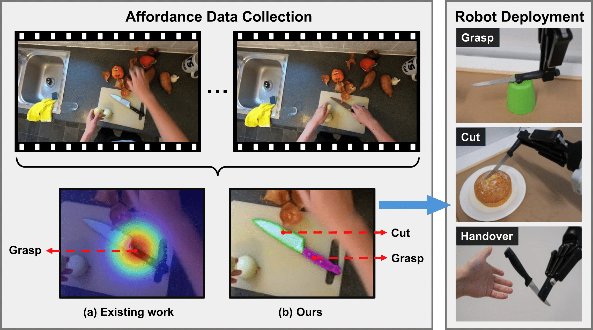

# Learning Precise Affordances from Egocentric Videos for Robotic Manipulation

[](https://arxiv.org/abs/2408.10123)
[](https://reagan1311.github.io/affgrasp/)

<div align=center>
    
</div>

## Overview
- Code for affordance extraction from egocentric videos is in the folder `ego2aff`
- Code for affordance model learning is in the folder `affordance-learning`
- Data: [Data_for_Aff-Grasp](https://huggingface.co/datasets/Gen1113/Data_for_Aff-Grasp)
- Model and Log: [Model_for_Aff-Grasp](https://huggingface.co/Gen1113/Model_for_Aff-Grasp)

## Citation

```
@article{li2025affgrasp,
      title     = {Learning Precise Affordances from Egocentric Videos for Robotic Manipulation}, 
      author    = {Li, Gen and Tsagkas, Nikolaos and Song, Jifei and Mon-Williams, Ruaridh and Vijayakumar, Sethu and Shao, Kun and Sevilla-Lara, Laura},
      journal   = {Proceedings of the IEEE/CVF International Conference on Computer Vision},
      year      = {2025},
    }
```

## Anckowledgement
Part of the code is derived from the [hand_object_detector](https://github.com/ddshan/hand_object_detector), [hoi-forecase](https://github.com/stevenlsw/hoi-forecast), [GroundedSAM](https://github.com/IDEA-Research/Grounded-Segment-Anything), and [ViT-Adapter](https://github.com/czczup/ViT-Adapter). Thanks for their great work!